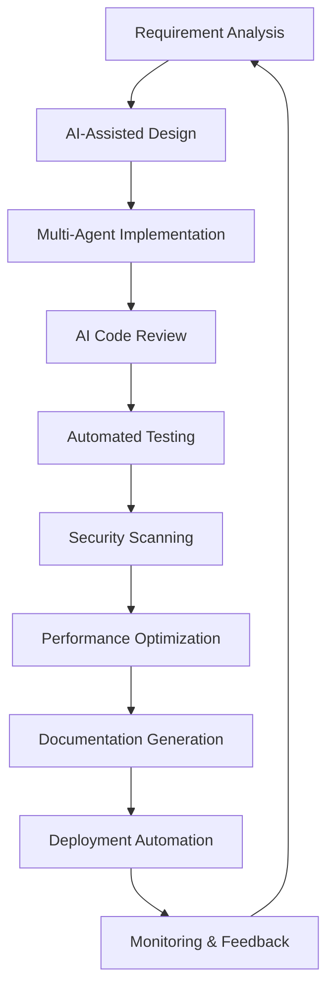

# 🤖 AI Coding Workflows 2026: Modern Development Methodologies

<div align="center">
    
    
    
</div>

---

## 🎯 Introduction

2026 has brought revolutionary changes to how developers work with AI. This document outlines modern workflows that leverage AI as a **core team member** rather than just a tool.

---

## 🔄 Core Workflow Patterns

### 1. **The AI-First Development Cycle**



#### **Phase 1: AI-Assisted Planning (15-20% of time)**
- **Requirements → AI Specifications**: Convert business requirements into AI-understandable specs
- **Architecture Generation**: AI suggests multiple architectural approaches with trade-offs
- **Resource Estimation**: AI predicts time, cost, and infrastructure needs

#### **Phase 2: Multi-Agent Implementation (30-40% of time)**
- **Frontend Agent**: Specialized in UI/UX, responsive design, accessibility
- **Backend Agent**: API design, database schema, business logic
- **DevOps Agent**: Infrastructure as Code, CI/CD pipelines, monitoring
- **QA Agent**: Test generation, edge case identification, performance testing

#### **Phase 3: AI-Driven Quality Assurance (20-25% of time)**
- **Automated Code Review**: Style consistency, best practices, security vulnerabilities
- **Intelligent Testing**: AI-generated tests covering edge cases and integration scenarios
- **Performance Profiling**: Real-time performance analysis and optimization suggestions

#### **Phase 4: Autonomous Deployment & Monitoring (15-20% of time)**
- **Self-Healing Deployments**: AI monitors and fixes deployment issues automatically
- **Predictive Scaling**: Anticipates traffic patterns and scales resources proactively
- **Continuous Optimization**: AI refactors code based on runtime performance data

---

### 2. **The Context-Aware Development Workflow**

#### **Repository Intelligence Layer**
```yaml
# .ai-context.yml
context_layers:
  business_domain:
    description: "E-commerce platform for sustainable products"
    constraints: ["GDPR compliant", "Carbon-neutral hosting"]
    
  technical_stack:
    primary: ["TypeScript", "Next.js 15", "NestJS", "PostgreSQL 16"]
    secondary: ["Redis", "Elasticsearch", "Kafka"]
    
  team_patterns:
    coding_style: "functional with TypeScript strict mode"
    testing: "80% coverage minimum, TDD encouraged"
    documentation: "JSDoc + OpenAPI + architecture decision records"
    
  performance_requirements:
    response_time: "p95 < 200ms"
    availability: "99.99% uptime"
    scalability: "10k concurrent users"
```

#### **Real-Time Context Updates**
- **Live Learning**: AI learns from every commit, PR, and code review
- **Pattern Recognition**: Identifies successful patterns and suggests reuse
- **Anomaly Detection**: Flags deviations from established team patterns

---

### 3. **The Collaborative AI Team Workflow**

#### **Human-AI Role Distribution**
| Role | Human Responsibility | AI Responsibility |
|------|---------------------|-------------------|
| **Product Manager** | Business requirements, user stories | Market analysis, feature prioritization |
| **Architect** | High-level design decisions | Implementation options, trade-off analysis |
| **Developer** | Complex logic, creative solutions | Boilerplate, patterns, optimization |
| **QA Engineer** | Test strategy, user experience | Test generation, edge case coverage |
| **DevOps Engineer** | Infrastructure strategy | Automation, monitoring, scaling |

#### **Daily Workflow Example**
```bash
# Morning: Planning & Context Setup
1. AI reviews overnight commits and updates context
2. AI suggests today's priorities based on project status
3. Team reviews AI-generated task breakdown

# Development Session (2-hour blocks)
1. Developer describes feature to AI assistant
2. AI generates implementation options with pros/cons
3. Developer selects approach, AI implements skeleton
4. Pair programming: Developer focuses on business logic, AI handles boilerplate

# Afternoon: Review & Integration
1. AI performs automated code review
2. AI runs comprehensive test suite
3. AI suggests performance optimizations
4. Team reviews AI-generated PR description

# End of Day: Learning & Improvement
1. AI analyzes day's work for patterns
2. AI updates team knowledge base
3. AI suggests skill development opportunities
```

---

## 🛠️ Tool-Specific Workflows

### **Cursor 4.0 Workflow**
```yaml
# .cursor/rules/mvp.v2
name: "2026 Modern Development"
description: "AI-first development with full context awareness"

rules:
  - "Always consider the full repository context"
  - "Generate tests alongside implementation"
  - "Prioritize security and performance"
  - "Document architectural decisions"
  - "Follow team's established patterns"

workflow:
  planning:
    - "Analyze requirements with business context"
    - "Generate multiple implementation options"
    - "Present trade-offs with data"
    
  implementation:
    - "Write self-documenting code"
    - "Include inline performance comments"
    - "Generate corresponding tests"
    
  review:
    - "Self-review before human review"
    - "Highlight potential issues"
    - "Suggest improvements"
```

### **Claude Code 3.0 Workflow**
```bash
# Project initialization
claude-code init --template=fullstack-2026 --context=.ai-context.yml

# Feature development
claude-code feature auth-service \
  --requirements="JWT, MFA, rate limiting" \
  --tech-stack="NestJS, PostgreSQL, Redis" \
  --tests="unit,integration,e2e"

# Code review automation
claude-code review --security --performance --best-practices

# Documentation generation
claude-code docs --format=openapi --include=examples
```

### **GitHub Copilot X Workflow**
```typescript
// AI-powered development sessions
interface AIDevelopmentSession {
  context: 'full-repository' | 'current-file' | 'multi-file';
  mode: 'pair-programming' | 'autonomous' | 'review';
  focus: 'implementation' | 'testing' | 'refactoring';
}

// Real-time collaboration
const teamSession = {
  participants: ['human-dev-1', 'ai-frontend', 'ai-backend', 'ai-qa'],
  sharedContext: true,
  liveUpdates: true,
  conflictResolution: 'ai-mediated'
};
```

---

## 📊 Workflow Metrics & Optimization

### **Key Performance Indicators (2026)**
| Metric | Target | Measurement Method |
|--------|--------|-------------------|
| **AI Utilization Rate** | >85% | Percentage of code touched by AI |
| **Context Accuracy** | >95% | AI's understanding of project requirements |
| **First-Pass Quality** | >90% | Code passing review without major changes |
| **Development Velocity** | 2-3x | Compared to traditional development |
| **Bug Introduction Rate** | <0.5% | Bugs per 1000 lines of AI-generated code |

### **Continuous Workflow Improvement**
```python
# Workflow optimization algorithm
class AIWorkflowOptimizer:
    def __init__(self):
        self.metrics = collect_development_metrics()
        self.patterns = identify_success_patterns()
        
    def optimize_workflow(self):
        # Analyze bottlenecks
        bottlenecks = self.identify_bottlenecks()
        
        # Suggest improvements
        improvements = self.generate_improvements(bottlenecks)
        
        # A/B test improvements
        results = self.test_improvements(improvements)
        
        # Implement successful changes
        self.implement_best_improvements(results)
        
    def adaptive_learning(self):
        # Learn from team feedback
        feedback = collect_team_feedback()
        
        # Update AI behavior
        update_ai_models(feedback)
        
        # Refine workflow patterns
        refine_workflow_patterns()
```

---

## 🎯 Best Practices for 2026 Workflows

### **1. Context Management**
- **Maintain a living `.ai-context.yml`** file
- **Update context with every major decision**
- **Share context across all team members and AI agents**
- **Version control your context files**

### **2. Quality Assurance**
- **AI-generated code requires human review** for business logic
- **Implement AI code review as a mandatory step**
- **Use multiple AI tools for cross-validation**
- **Maintain human oversight for security-critical code**

### **3. Team Collaboration**
- **Treat AI as a team member** with defined responsibilities
- **Establish clear handoff protocols** between humans and AI
- **Regularly review AI performance** and adjust workflows
- **Foster AI literacy** across the entire team

### **4. Security & Compliance**
- **AI security scanning** in every commit
- **Compliance validation** for regulated industries
- **Audit trails** for all AI-generated code
- **Regular security training** for AI tools

---

## 🔮 Future Workflow Evolution (2027+)

### **Predictive Development**
- AI anticipates feature requests before they're made
- Proactive refactoring based on usage patterns
- Automated technology migration planning

### **Emotional Intelligence Integration**
- AI understands team dynamics and morale
- Adaptive communication styles based on individual preferences
- Conflict resolution and team building assistance

### **Cross-Organizational Learning**
- Federated learning across companies (privacy-preserving)
- Industry-wide best practice sharing
- Global AI development standards

---

## 📚 Resources & Further Reading

### **Official Documentation**
- [AI Development Workflow Standards](https://aistandards.org/workflows) - Industry standards
- [Cursor Workflow Library](https://cursor.sh/workflows) - Pre-built workflows
- [Claude Code Cookbooks](https://cookbooks.anthropic.com) - Advanced patterns

### **Community Resources**
- **r/AIDevelopmentWorkflows** - Reddit community
- **AI Workflow Patterns** GitHub repository
- **Dev.to AI Workflow Series** - Blog posts and tutorials

### **Research & Case Studies**
- "Measuring AI Development Productivity" - 2026 ACM Study
- "Human-AI Collaboration Patterns in Enterprise Teams" - Google Research
- "Security Implications of AI-First Development" - OWASP AI Security Project

---

## 🏆 Success Stories (2026)

### **Company A: 300% Productivity Increase**
- **Before**: 10 developers, 6-month project timeline
- **After**: 5 developers + AI, 2-month timeline
- **Key workflow**: Multi-agent implementation with daily AI standups

### **Startup B: Zero to MVP in 30 Days**
- **Challenge**: Build complete SaaS platform with limited resources
- **Solution**: AI-first development with autonomous agents
- **Result**: Fully functional MVP with 90% AI-generated code

### **Enterprise C: Legacy Modernization**
- **Problem**: 15-year-old monolith needing modernization
- **Approach**: AI-assisted incremental refactoring
- **Outcome**: 70% reduction in modernization timeline

---

## 📝 Implementation Checklist

### **Getting Started (Week 1)**
- [ ] Set up AI development environment
- [ ] Create `.ai-context.yml` for your project
- [ ] Establish basic AI workflow (plan → implement → review)
- [ ] Train team on AI tool basics

### **Advanced Integration (Month 1)**
- [ ] Implement multi-agent workflows
- [ ] Set up automated AI code review
- [ ] Establish metrics tracking
- [ ] Create team AI guidelines

### **Full Optimization (Quarter 1)**
- [ ] Implement predictive development features
- [ ] Set up cross-team AI collaboration
- [ ] Establish continuous workflow improvement
- [ ] Contribute to community best practices

---

<div align="center">
    <sub>Last Updated: March 2026 | Contribute via PR with your workflow experiences</sub>
</div>